# Angelique – English Translation (SNES / Super Famicom)

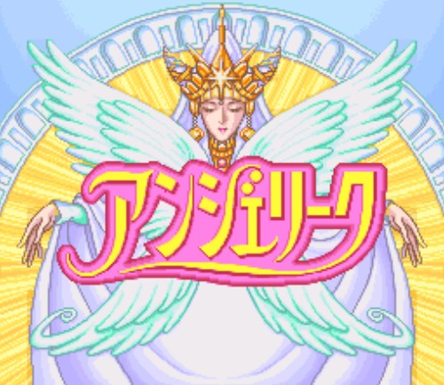

An English fan translation of **Angelique** (アンジェリーク), the 1994 Super Famicom game by Koei.
This was the first game in the Neo Romance series. You play Angelique Limoges, one of two
Queen candidates. With the help of the nine Guardians you must grow your continent faster
than your rival Rosalia.

**Current version: v0.99** – beta. The full script is translated, and most interface
graphics have been redrawn.

## Screenshots

| | |
|---|---|
| 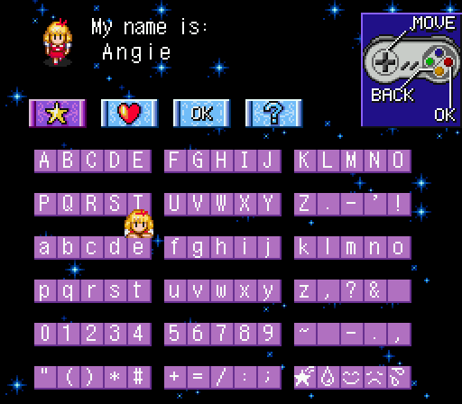 | 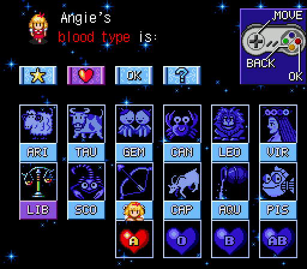 |
| 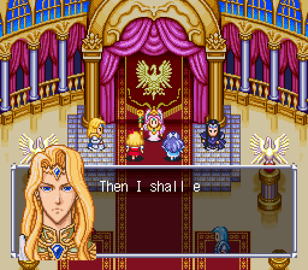 | 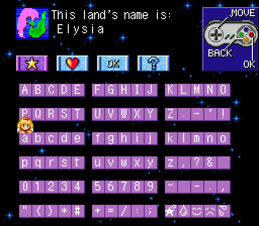 |
| 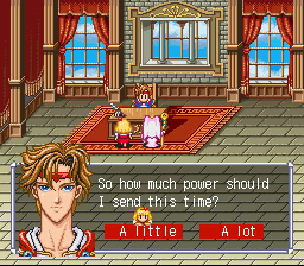 | 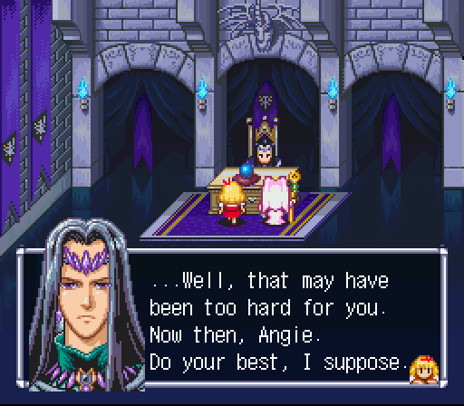 |
| 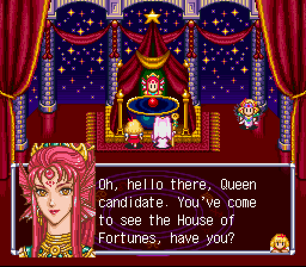 | 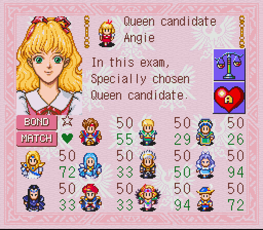 |
|  | 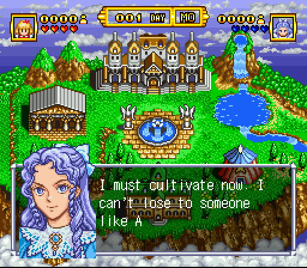 |

## Translation status

| Part | Status |
|---|---|
| Dialogue (429 compressed dialogue packs, 8,270 entries) | ✅ 100 % |
| Menus, system messages, reports (1,799 strings in code banks) | ✅ 100 % (only format strings like `%3d` are left as they are) |
| Player and land name entry (Latin letters, numbers, punctuation) | ✅ |
| Star sign / blood type screen, controller legend | ✅ redrawn |
| Status bar (DAY counter, weekdays SU–SA, population icon) | ✅ redrawn |
| Guardian profile and High Priest report labels (BOND, MATCH, POP, LEFT …) | ✅ redrawn |
| Town map signs (お休み → CLOSED) | ✅ redrawn |
| Title logo | ❌ still Japanese |
| Full playtest of all endings | 🔄 in progress |

## Graphics: before / after

Left: original Japanese, right: English patch.

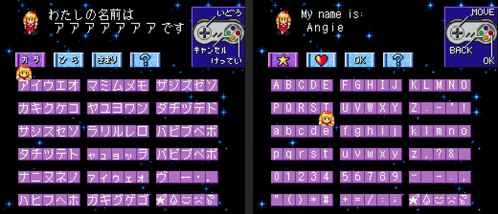
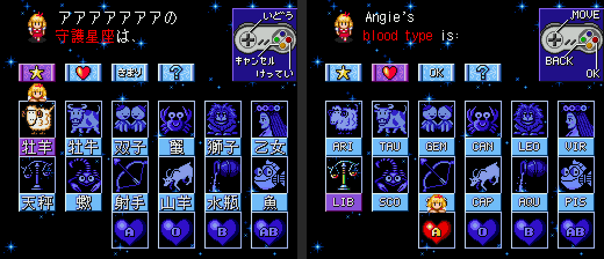
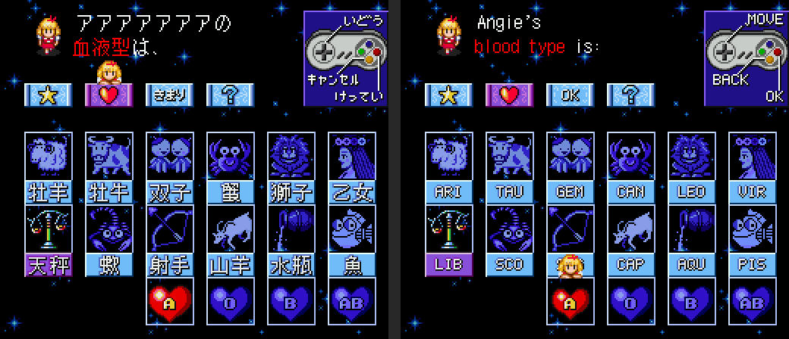
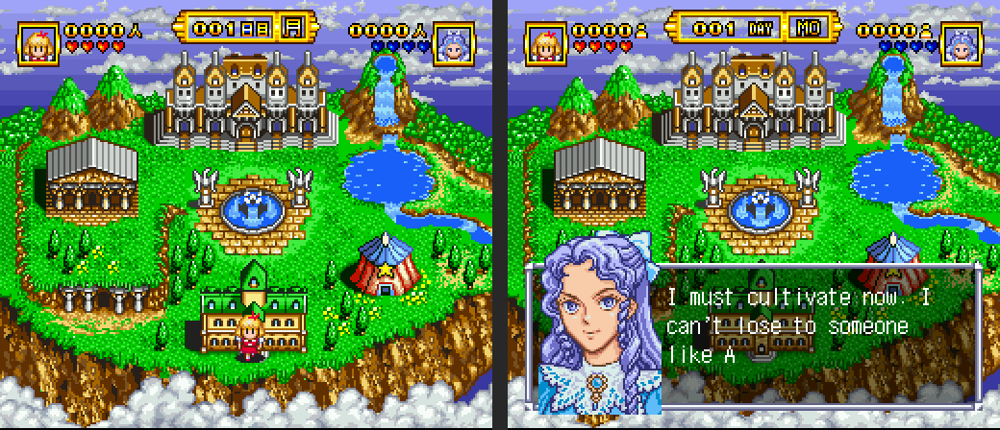

## How to patch

You need the **original Japanese ROM**. The ROM is not provided here.

| | |
|---|---|
| File | `Angelique (Japan).sfc`, 2 MB (16 Mbit), **no copier header** |
| CRC32 | `EC3EDB9E` |
| MD5 | `2df6243223f89ec161b5e015b085f7a0` |
| SHA-1 | `4824bccebfd0f4f89e89993e0edb81d604105e38` |

1. Download `Angelique_EN_v0.99_neocrypton.ips`.
2. Apply it to the ROM with an IPS patcher, such as [Lunar IPS](https://fusoya.eludevisibility.org/lips/), [Floating IPS](https://www.romhacking.net/utilities/1040/) or the online [Rom Patcher JS](https://www.marcrobledo.com/RomPatcher.js/).
3. The patched ROM is **4 MB** (32 Mbit HiROM), with internal title `ANGELIQUE`.
   - CRC32 `89FC8894`
   - SHA-1 `6171256da64bf2b306b514b22defa9b9cce4cc06`

If your ROM has a 512-byte copier header (file size 2,097,664 bytes), remove the header before patching.

Tested with snes9x. It should run on any accurate emulator (bsnes, Mesen 2, snes9x) and on
flash carts that support 32 Mbit HiROM.

## Known issues

- The title logo is still in Japanese.
- Player and land names can have up to 7 characters, because the game stores each letter as 2 bytes.
- The game uses its original fixed-width font, so a few text boxes are split across two pages.
- Please report any freezes, text overflow or untranslated text in the
  [issue tracker](../../issues). If you can, include a screenshot or a save state.

## Changelog

### v0.99 (2026-10-02)
- Fixed a freeze in the continent reports. Some English report lines were longer than the
  game's 150-byte text buffer.
- Town map: the Saturday and Sunday お休み signs are now wooden **CLOSED** signboards
  (Royal Research Institute and the fortune teller's tent).

### v0.95 (2026-10-01)
- First public release: complete script translation, English font, name entry,
  star sign / blood type screen, status bar and profile / report labels.

## Credits

- **Translation & ROM hacking:** neocrypton
- **English font:** Shinonome 6×12 (public domain)
- **Original game:** © 1994 Koei

This is an unofficial fan project and is not affiliated with Koei Tecmo. Please support the
official releases of the Angelique series.
